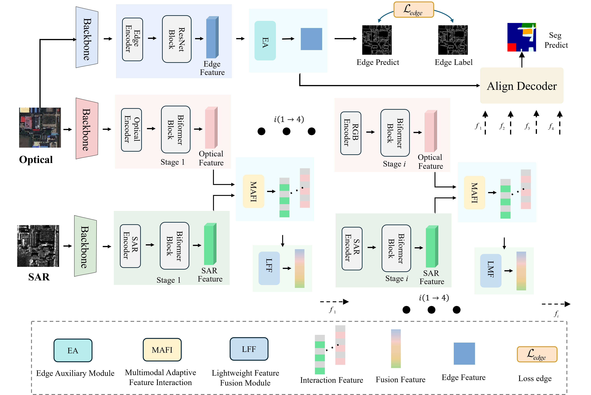

# EG-CMFNet

This repository provides the official implementation of **EG-CMFNet: An Edge-Guided Cross-Modal Fusion Network for Remote Sensing Semantic Segmentation**.

Paper link: [IEEE Xplore](https://ieeexplore.ieee.org/document/11481201)

---

## Table of Contents

- [Introduction](#introduction)
- [Overall Architecture](#overall-architecture)
- [Citation](#citation)

---

## Introduction

We propose a novel **Edge-Guided Cross-Modal Fusion Network (EG-CMFNet)** for multimodal remote sensing semantic segmentation.

Specifically, EG-CMFNet adopts a multi-stream CNN and Transformer architecture to extract global semantic features from optical and SAR images. The proposed **Multimodal Adaptive Feature Interaction (MAFI)** modules and **Lightweight Feature Fusion (LFF)** modules are designed to perform adaptive cross-modal interaction and efficient multiscale feature fusion across hierarchical feature levels.

In addition, a CNN-based edge branch introduces an **Edge Auxiliary (EA)** module to refine object boundaries by leveraging edge information.

---

## Overall Architecture

The overall architecture of EG-CMFNet is shown below.



---

## Citation

If you find this work useful, please consider citing our paper:

```bibtex
@ARTICLE{11481201,
  author={Zhao, Jinqi and Zhou, Zhonghuai and Zhang, Liansong and Wang, Linxin and Lu, Zhong},
  journal={IEEE Transactions on Geoscience and Remote Sensing},
  title={EG-CMFNet: An Edge-Guided Cross-Modal Fusion Network for Remote Sensing Semantic Segmentation},
  year={2026},
  volume={64},
  number={},
  pages={1-20},
  keywords={Satellite images;Earth Observing System;Feeds;Apertures;Antennas;Filtering;Filters;Speckle;Circuits;Feedback;CNN;edge information;multimodal remote sensing data;semantic segmentation;Transformer},
  doi={10.1109/TGRS.2026.3680719}
}
```
